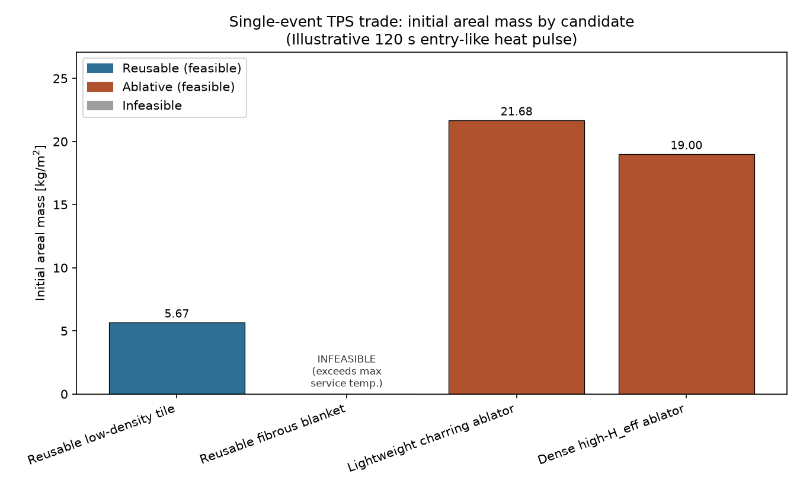
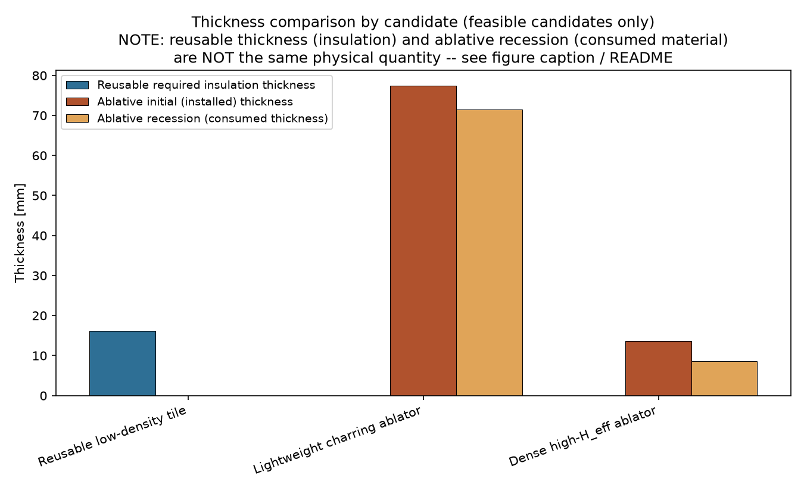
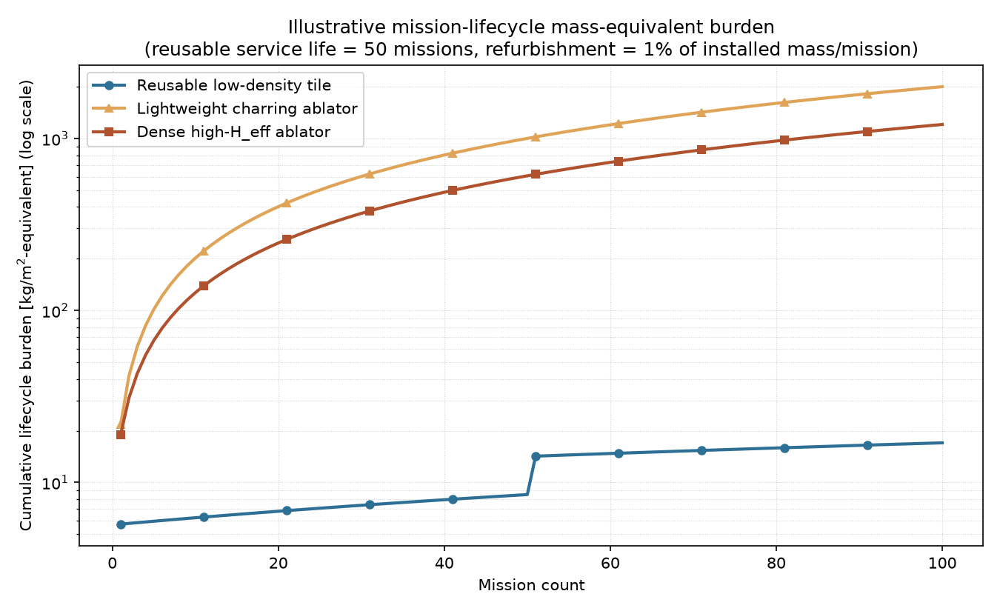
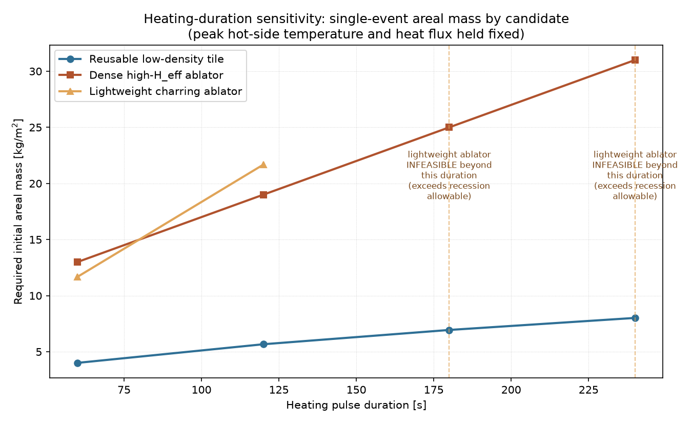

# TPS Material Trade (STM-05)

A verified, from-first-principles engineering trade between **reusable**
and **ablative** thermal protection system (TPS) concepts: steady and
transient 1-D conduction sizing, first-order ablative recession sizing, a
single-event mass trade, and a repeated-mission lifecycle trade -- all
implemented as a small, tested Python package (`tps_trade`) with 156
automated tests and reproducible example scripts.

**Engineering question:** For a defined illustrative atmospheric-entry-like
heating case, which TPS concept minimizes areal mass? How do reusable and
ablative concepts compare under single-event and repeated-mission
assumptions? And which modeling assumptions most strongly control the
recommendation?

## Key result



For the canonical illustrative study case defined below, the **Reusable
low-density tile** is the minimum-areal-mass **feasible** candidate --
both for a single heating event (5.67 kg/m²) and across every
repeated-mission and sensitivity case examined (see
"[Engineering recommendation](#engineering-recommendation)"). This
conclusion is specific to the illustrative candidates, thermal case, and
lifecycle assumptions defined in this project -- see
"[Limitations](#limitations)" before generalizing it.

## Engineering workflow

The project builds one verified capability at a time, each stage reusing
the one before it without duplicating equations:

```
steady 1-D conduction
   -> transient 1-D conduction
      -> reusable TPS thickness sizing
         -> first-order ablative recession sizing
            -> reusable-vs-ablative single-event trade
               -> repeated-mission lifecycle trade
```

| Layer | Module | Purpose |
|---|---|---|
| Steady conduction | [`tps_trade.conduction`](src/tps_trade/conduction.py) | Analytical steady-state reusable-slab sizing (reference case) |
| Transient conduction | [`tps_trade.transient`](src/tps_trade/transient.py) | Finite-difference reusable-slab sizing against a finite-duration pulse |
| Ablative sizing | [`tps_trade.ablative`](src/tps_trade/ablative.py) | Lumped heat-load-to-recession ablative sizing |
| Single-event trade | [`tps_trade.trade`](src/tps_trade/trade.py) | Sizes every candidate against one shared study case, ranks by areal mass |
| Lifecycle trade | [`tps_trade.lifecycle`](src/tps_trade/lifecycle.py) | Extends the single-event trade to repeated missions |
| Candidate database | [`tps_trade.candidates`](src/tps_trade/candidates.py) | The canonical study case and illustrative candidate materials |

## Canonical thermal case

One illustrative, entry-like heating event (`tps_trade.candidates.STUDY_CASE`)
is shared by every candidate:

| Quantity | Value |
|---|---|
| Initial temperature | 300.0 K |
| Peak hot-side temperature (reusable) | 1400.0 K |
| Heating pulse duration | 120.0 s |
| Total reusable simulation duration | 600.0 s |
| Backface temperature limit (reusable) | 450.0 K |
| Net heat flux (ablative) | 1.000e+06 W/m² |
| Integrated ablative heat load | 1.200e+08 J/m² |

**This is not a certified vehicle trajectory.** More importantly: the
reusable model is driven by a prescribed **hot-side TEMPERATURE** history
(a Dirichlet boundary condition), while the ablative model is driven by a
prescribed **net heat-FLUX** history (energy integrated directly into
consumed mass). These are two different simplified boundary-condition
formulations, not physically identical descriptions of the same event --
there is no surface-energy-balance derivation here converting one into the
other. Both are picked to represent "the same" illustrative event
qualitatively; treat the correspondence as illustrative, not derived. This
is the single most important caveat in the whole project.

## Reusable TPS model

A homogeneous 1-D slab (`x=0` hot surface, `x=t` backface, all temperatures
absolute in K):

**Steady conduction** (analytical reference case):

```
R'' = t / k
T_back = T_hot - q'' t / k
t_req  = k (T_hot - T_back,max) / q''
m_A    = rho * t
```

**Transient conduction** (finite-duration pulse, explicit FTCS
finite-difference):

```
dT/dt = alpha * d^2T/dx^2          alpha = k / (rho * cp)
Fo = alpha * dt / dx^2             stability requires Fo <= 0.5
```

Interior update `T_new[i] = T[i] + Fo*(T[i+1] - 2T[i] + T[i-1])`; hot side
is Dirichlet (prescribed `T_hot(t)`); backface is insulated
(zero-gradient) by default, or optionally a second prescribed temperature.
`solve_transient_conduction` independently checks `Fo <= 0.5` and raises
rather than silently running an unstable step. Thickness is sized via
bounded bisection against a backface-temperature limit
(`size_thickness_transient`).

**Margin** (dimensional, not a factor of safety):
`Margin_T = T_back,max - T_back,predicted`.

## Ablative TPS model

A separate, first-order **lumped energy-to-recession** model (no shared
code with the reusable conduction model):

```
Q''            = integral q''(t) dt            total net heat load [J/m^2]
m''_consumed   = Q'' / H_eff                   consumed areal mass [kg/m^2]
delta          = Q'' / (rho * H_eff)           recession depth [m]
t_initial      = delta + t_retained            required initial thickness [m]
m''_initial    = rho * t_initial               initial areal mass [kg/m^2]
```

`t_retained` (the thickness that must survive the event) is an explicit
engineering input, never invented or certified by this model. Mass
decomposes exactly: `m''_initial = m''_remaining + m''_consumed`. Margin
(dimensional): `Margin_t = t_trial - delta - t_retained`, or an optional
recession margin `Margin_delta = max_recession - delta`.

Assumptions: net heat flux only (negative flux rejected), constant `rho`
and `H_eff`, no internal conduction/pyrolysis coupling, no char-layer
resistance, no radiative feedback, no surface chemistry, no blowing
correction.

## Candidate materials

All properties below are **ILLUSTRATIVE / REPRESENTATIVE ONLY** -- none
are sourced from a specific material data sheet, and none represent a
real, named TPS material (e.g. Shuttle tile, PICA, Avcoat) or a certified
allowable.

**Reusable** (`tps_trade.candidates.REUSABLE_CANDIDATES`):

| Name | rho [kg/m³] | k [W/(m·K)] | cp [J/(kg·K)] | Max service temp [K] |
|---|---|---|---|---|
| Reusable low-density tile | 350.0 | 0.060 | 1050.0 | 1650.0 |
| Reusable fibrous blanket | 150.0 | 0.045 | 1200.0 | 1250.0 |

The fibrous blanket's service-temperature limit (1250 K) is **deliberately
below** the study case's peak hot-side temperature (1400 K), so the
database itself demonstrates the service-temperature feasibility gate.

**Ablative** (`tps_trade.candidates.ABLATIVE_CANDIDATES`, each pairing an
`AblativeMaterial` with a `retained_thickness` and an illustrative
`max_recession` allowable):

| Name | rho [kg/m³] | H_eff [J/kg] | Retained thickness [mm] | Max recession [mm] |
|---|---|---|---|---|
| Lightweight charring ablator | 280.0 | 6.000e+06 | 6.0 | 90.0 |
| Dense high-H_eff ablator | 1400.0 | 1.000e+07 | 5.0 | 20.0 |

## Verification strategy

156 automated tests ([tests/](tests/)) verify the model chain end to end,
including:

- Steady analytical conduction identities (`R''=t/k`, `T_back`, inverse
  thickness recovery, `k`/`q''` scaling)
- Transient FTCS stability enforcement (`Fo<=0.5` rejected/accepted) and
  uniform-temperature equilibrium
- An analytical semi-infinite step-temperature (`erf`) reference comparison
- Spatial/time grid-convergence checks
- Transient thickness-sizing boundary verification (exact/over/under margin)
- Ablative heat-load hand calculations (constant, piecewise, sampled
  trapezoidal), recession/mass scaling, and mass decomposition
- Service-temperature feasibility gating in the single-event trade
- Deterministic candidate ranking (mass-based, tie-broken, infeasible
  candidates always excluded)
- Lifecycle hand calculations (one-mission identities, replacement-count
  convention, refurbishment scaling), the break-even/crossover search, and
  a constructed case where the lifecycle ranking differs from the
  single-event ranking

| Module | Tests |
|---|---|
| Steady conduction (`conduction.py`, `materials.py`) | 38 |
| Transient conduction (`transient.py`) | 31 |
| Ablative sizing (`ablative.py`) | 36 |
| Single-event trade (`trade.py`, `candidates.py`) | 27 |
| Lifecycle trade (`lifecycle.py`) | 24 |
| **Total** | **156** |

Run `python -m pytest -q` to reproduce; see `tests/test_*.py` for the
complete, itemized verification plan per module (docstrings map directly
to the analytical case each test checks).

## Single-event trade

Every candidate is sized against the identical canonical study case
(`run_trade_study`), then ranked by initial areal mass among thermally
feasible candidates only (`rank_feasible_by_mass`):

| Name | Category | Feasible | Thickness | Areal mass [kg/m²] | Governing metric |
|---|---|---|---|---|---|
| Reusable low-density tile | reusable | ✅ | 16.20 mm | **5.67** | Peak T_back = 449.9 K |
| Reusable fibrous blanket | reusable | ❌ (exceeds service temp.) | -- | -- | -- |
| Dense high-H_eff ablator | ablative | ✅ | 13.57 mm | 19.00 | Recession = 8.57 mm |
| Lightweight charring ablator | ablative | ✅ | 77.43 mm | 21.68 | Recession = 71.43 mm |



Reusable *thickness* (insulation retained through the event) and ablative
*recession* (material consumed during the event) are **not the same
physical quantity** -- the figure above deliberately keeps them as
separate series rather than implying they are interchangeable.

Reproduce with `python examples/tps_material_trade.py`.

## Lifecycle trade

The single-event result is extended to repeated missions with an explicit,
illustrative mass-equivalent accounting convention (see
[`tps_trade.lifecycle`](src/tps_trade/lifecycle.py) for the full formulas):
reusable candidates carry an installed mass plus a per-mission
refurbishment-equivalent penalty and occasional full replacement at their
service life; ablative candidates carry their initial mass plus
replenishment of the consumed mass every subsequent mission.



Cumulative lifecycle burden [kg/m²-equivalent] (baseline: reusable service
life = 50 missions, refurbishment fraction = 1% of installed mass/mission):

| Missions | Reusable tile | Lightweight ablator | Dense ablator | Winner |
|---|---|---|---|---|
| 1 | 5.73 | 21.68 | 19.00 | Reusable tile |
| 5 | 5.95 | 101.68 | 67.00 | Reusable tile |
| 10 | 6.24 | 201.68 | 127.00 | Reusable tile |
| 25 | 7.09 | 501.68 | 307.00 | Reusable tile |
| 50 | 8.50 | 1001.68 | 607.00 | Reusable tile |
| 100 | 17.01 | 2001.68 | 1207.00 | Reusable tile |

A deterministic break-even search (`find_breakeven_mission_count`, 1-500
missions) between the reusable tile and the dense ablator finds **no
crossover** -- the tile leads throughout the searched range (85.03 vs.
6007.00 kg/m²-equivalent at 500 missions). The fibrous blanket remains
excluded at every mission count: lifecycle assumptions never override
thermal infeasibility.

Reproduce with `python examples/tps_lifecycle_trade.py`.

## Sensitivity



**A. Heating duration** (peak temperature/flux fixed, duration varied):
the reusable tile's mass grows slowly (transient penetration scales with
√time); each ablative candidate's mass grows roughly linearly with the
constant flux held over more time. Ranking never changes, but the
lightweight ablator becomes **infeasible** beyond ~180 s once its
recession exceeds its illustrative structural allowable.

| Duration | Tile mass [kg/m²] | Dense ablator mass [kg/m²] | Lightweight ablator |
|---|---|---|---|
| 60 s | 4.01 | 13.00 | 11.68 (feasible) |
| 120 s | 5.67 | 19.00 | 21.68 (feasible) |
| 240 s | 8.01 | 31.00 | **infeasible** |

**B. Refurbishment fraction** (reusable tile, 50 missions): 0% -> 5.67,
1% -> 8.50, 2% -> 11.34, 5% -> 19.84 kg/m²-equivalent -- all still far
below the dense ablator's 50-mission burden (607.00).

**C. Reusable service life** (tile, 100 missions, f_refurb=1%): 10 missions
-> 62.36 (9 replacements), 25 -> 28.34 (3), 50 -> 17.01 (1), 100 -> 11.34
(0) -- all still far below the dense ablator's 100-mission burden (1207.00).

None of these sensitivities change the ranking in this candidate set: the
ablative candidates' per-mission consumed mass is simply large relative to
the reusable tile's installation/refurbishment burden. A different
candidate set (a much lower-consumption ablator, or a very short reusable
service life) could show a different, or crossing, result -- no crossover
is forced anywhere in this project.

Reproduce all of the above in one run with
`python examples/final_tps_trade.py`, or regenerate the figures with
`python examples/generate_portfolio_figures.py`.

## Engineering recommendation

Under the defined illustrative thermal and lifecycle assumptions, **the
reusable low-density tile is the minimum-areal-mass feasible candidate for
both the single-event and the repeated-mission trade.**

This recommendation should be read narrowly:

- The reusable and ablative models do **not** use identical
  boundary-condition formulations (prescribed temperature vs. prescribed
  heat flux) -- see "Canonical thermal case" above.
- The lifecycle assumptions used here (a 50-mission reusable service life,
  a 1% mass-equivalent refurbishment penalty) **strongly favor reusable
  systems** once repeated missions are considered; a different candidate
  set or different assumptions are not guaranteed to agree.
- Refurbishment-equivalent burden is a mass bookkeeping convention, **not**
  real monetary cost or labor.
- All candidate material properties are **illustrative**, not sourced
  design allowables.
- **No certified-vehicle conclusion is being made.** This is a preliminary,
  illustrative, single-study-case model comparison -- not a claim that
  "reusable TPS is better than ablative TPS" in general. Ablative concepts
  may remain the practical choice for high-heating or genuinely
  single-use mission concepts despite their higher modeled burden here.

## Limitations

**Reusable model:** 1-D slab only; constant material properties (no
temperature dependence); prescribed hot-side temperature (no convective/
radiative surface energy balance); no joints, gaps, or coatings; no
structural durability assessment.

**Ablative model:** lumped heat-to-recession bookkeeping only; no
pyrolysis kinetics; no moving-boundary conduction solution; no char-layer
conduction; no blowing (mass-injection) correction; no surface chemistry;
no radiative feedback.

**Lifecycle model:** refurbishment expressed only as an illustrative
mass-equivalent penalty (no actual cost, no labor, no inspection
scheduling); no probability of damage; no degradation with cycle count;
ablative replenishment simplified to consumed material only.

**Trade-level:** the reusable and ablative boundary-condition models are
not physically identical; all material properties are illustrative; this
is not a certification analysis; and it is not a vehicle-specific
recommendation.

## Repository structure

```
src/tps_trade/        Package: conduction, transient, ablative, trade,
                       lifecycle, candidates, materials, _validation
tests/                156 automated tests, one file per module
examples/             Runnable scripts reproducing every result above
figures/              Portfolio PNG figures (generated, committed)
README.md             This document
pyproject.toml        Package metadata and optional dependency groups
```

## Reproduction

```bash
python3 -m venv .venv
source .venv/bin/activate
pip install -e ".[dev,figures]"

python -m pytest -q                                # 156 tests

python examples/sanity_case.py                      # steady reusable sizing
python examples/transient_heating_study.py          # transient reusable sizing
python examples/ablative_sanity_case.py             # ablative sizing
python examples/tps_material_trade.py               # single-event trade
python examples/tps_lifecycle_trade.py              # lifecycle trade
python examples/final_tps_trade.py                  # everything, one run
python examples/generate_portfolio_figures.py       # regenerate figures/*.png
```

The `figures` extra (`matplotlib`) is only required for
`generate_portfolio_figures.py`; every other script and the full test
suite need only the `dev` extra.

## License

MIT -- see [LICENSE](LICENSE).
